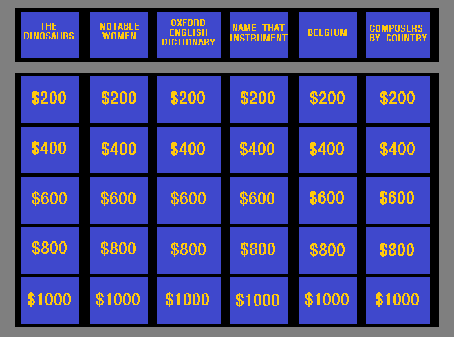

# Introduction

Jeopardy is a popular TV show in the US where participants answer trivia to win money. Participants are given a set of categories to choose from and a set of questions that increase in difficulty. As the questions get more difficult, the participant can earn more money for answering correctly.

In June 2019, contestant James Holzhauer ended a 32-game winning streak, just barely missing the record for highest winnings. James Holzhauer dedicated hours of effort to optimizing what he did during a game to maximize how much money he earned. To achieve what he did, James had to learn and master the vast amount of trivia that Jeopardy can throw at the contestants.

Let's say we want to compete on Jeopardy like James. As he did, we'll have to familiarize ourselves with an enormous amount of trivia to be competitive. Given the vastness of the task, is there a way that we can somehow simplify our studies and prioritize topics that appear more often in Jeopardy? In this project, we'll work with a dataset of Jeopardy questions to figure out some patterns in the questions that could help us win.


```{r setup }
library(tidyverse)
```

# Data Import


```{r}
jeopardy = read_csv("jeopardy.csv")
```

```{r}
head(jeopardy)
```

```{r}
colnames(jeopardy)
```

```{r}
# the clean_names() function from the janitor package would have been great here too
colnames(jeopardy) = c("show_number", "air_date", "round", "category", "value", "question", "answer")
```

```{r}
sapply(jeopardy, typeof)
```

# Fixing Data Types

The value column actually incorporates a dollar sign and uses the value `None` in places where the question came from a Final Jeopardy, the last question of every episode. The presence of these factors causes R to convert this column to a character instead of a numerical one. For our later analysis, we'll need the value column to be numeric, so we should do this now.

```{r}
unique(jeopardy$value)
```

```{r}
# Removing Nones, cleaning the text, and converting everything into numeric
jeopardy = jeopardy %>% 
  filter(value != "None") %>% 
  mutate(
    value = str_replace_all(value, "[$,]", ""),
    value = as.numeric(value)
  )
```

```{r}
unique(jeopardy$value)
```

# Normalizing Text

One messy aspect about the Jeopardy dataset is that it contains text. Text can contain punctuation and different capitalization, which will make it hard for us to compare the text of an answer to the text of a question. We would like to make this process easier for ourselves, so we'll need to process the text data in this step. The process of cleaning text in data analysis is sometimes called normalization. More specifically, we want ensure that we lowercase all of the words and any remove punctuation. We remove punctuation because it ensures that the text stays as purely letters. Before normalization, the terms Don't and don't are considered to be different words, and we don't want this. For this step, normalize the question, answer, and category columns.
```{r}
head(jeopardy)
```


```{r}
# The stringr library is automatically brought in when tidyverse is brought in
# Notice how there is a space in the regular expression
jeopardy = jeopardy %>% 
  mutate(
    question = tolower(question),
    question = str_replace_all(question, "[^A-Za-z0-9 ]", ""),
    answer = tolower(answer),
    answer = str_replace_all(answer, "[^A-Za-z0-9 ]", ""),
    category = tolower(category),
    category = str_replace_all(category, "[^A-Za-z0-9 ]", "")
  )
```


# Making Dates More Accessible

In our last data cleaning step, we need to address the `air_date` column. Like `value`'s original type, `air_date` is a `character`. Ideally we would want to separate this column into a `year`, `month` and `day` column to make filtering easier in the future. Furthermore, we would also want each of these new date columns to be numeric to make comparison easier as well.

```{r}
jeopardy = jeopardy %>% 
  separate(., air_date, into = c("year", "month", "day"), sep = "-") %>% 
  mutate(
    year = as.numeric(year),
    month = as.numeric(month),
    day = as.numeric(day)
  )
```

# Focusing On Particular Subject Areas

We are now in a place where we can properly ask questions from the data and perform meaningful hypothesis tests on it. Given the near infinite amount of questions that can be asked in Jeopardy, you wonder if any particular subject area has increased relevance in the dataset. Many people seem to think that science and history facts are the most common categories to appear in Jeopardy episodes. Others feel that Shakespeare questions gets an awful lot of attention from Jeopardy.

With the chi-squared test, we can actually test these hypotheses! For this exercise, let's assess if science, history and Shakespeare have a higher prevalence in the data set. First, we need to develop our null hypotheses. There are around 3369 unique categories in the Jeopardy data set after doing all of our cleaning. If we suppose that no category stood out, we would expect that the probability of picking a random category would be the same no matter what category you picked. This comes out to be $1/3369$. This would also mean that the probability of not picking a particular category would be $3368/3369$. When we first learned the `chisq.test()` function when testing for the number of males and females in the Census data, we assumed that their proportion would be equal — that there would be a 50-50 split between them. The `chisq.test()` automatically assumes this of the data you provide it, but we can also specify what these proportions should be using the `p` argument.

```{r}
n_questions = nrow(jeopardy)
p_category_expected = 1/3369 
p_not_category_expected = 3368/3369 
```

```{r}
categories = pull(jeopardy, category)
n_science_categories = 0
# Count how many times the word science appears in the categories
for (c in categories) {
  if ("science" %in% c) {
    n_science_categories = n_science_categories + 1
  }
}
science_obs = c(n_science_categories, n_questions - n_science_categories)
p_expected = c(1/3369, 3368/3369)
chisq.test(science_obs, p = p_expected)
```

```{r}
n_history_categories = 0
# Count how many times the word science appears in the categories
for (c in categories) {
  if ("history" %in% c) {
    n_history_categories = n_history_categories + 1
  }
}
history_obs = c(n_history_categories, n_questions - n_history_categories)
p_expected = c(1/3369, 3368/3369)
chisq.test(history_obs, p = p_expected)
```

```{r}
n_shakespeare_categories = 0
# Count how many times the word science appears in the categories
for (c in categories) {
  if ("shakespeare" %in% c) {
    n_shakespeare_categories = n_shakespeare_categories + 1
  }
}
shakespeare_obs = c(n_shakespeare_categories, n_questions - n_shakespeare_categories)
p_expected = c(1/3369, 3368/3369)
chisq.test(shakespeare_obs, p = p_expected)
```

We see p-values less than 0.05 for each of the hypothesis tests. From this, we would conclude that we should reject the null hypothesis that science doesn't have a higher prevalence than other topics in the Jeopardy data. We would conclude the same with history and Shakespeare.

# Unique Terms in Questions

Let's say we want to investigate how often new questions are repeats of older ones. To start on this process, we can do the following:

1. Sort jeopardy in order of ascending air date.
2. Initialize an empty vector to store all the unique terms that are in the Jeopardy questions.
3. For each row, split the value for question into distinct words, remove any word shorter than 6 characters, and check if each word occurs in terms_used.


```{r}
# Pull just the questions from the jeopardy data
questions = pull(jeopardy, question)
terms_used = character(0)
for (q in questions) {
  # Split the sentence into distinct words
  split_sentence = str_split(q, " ")[[1]]
  
  # Check if each word is longer than 6 and if it's currently in terms_used
  for (term in split_sentence) {
    if (!term %in% terms_used & nchar(term) >= 6) {
      terms_used = c(terms_used, term)
    }
  }
}
```


# Terms In Low and High Value Questions

Let's say we only want to study terms that have high values associated with it rather than low values. This optimization will help us earn more money when we're on Jeopardy while reducing the number of questions we have to study. To do this, we need to count how many high value and low value questions are associated with each term. We'll define low and high values as follows:

* Low value: Any row where value is less than 800.
* High value: Any row where value is greater or equal than 800.



For each category, we can see that under this definition that for every 2 high value questions, there are 3 low value questions. Once we count the number of low and high value questions that appear for each term, we can use this information to our advantage. If the number of high and low value questions is appreciably different from the 2:3 ratio, we would have reason to believe that a term would be more prevalent in either the low or high value questions. We can use the chi-squared test to test the null hypothesis that each term is not distributed more to either high or low value questions.

To do this, we need:

1. Create an empty dataset that we can add more rows to
2. Iterate through all the different terms in terms_used.
3. For each term:
  * Iterate through all of the questions in the dataset and see if the term is present in each question.
  * If the term is present in the question, we then need to check if the question is high or low value
  * After iterating through all the questions, test the null hypothesis using the information we discussed above.
  * Each term should be associated with a high value question count, a low value question count, and a p-value. Turn these values into a vector and append it to the empty dataset you created.

```{r}
# Going only through the first 20 terms for shortness
# But you can remove the indexing to perform this code on all the terms
values = pull(jeopardy, value)
value_count_data = NULL
for (term in terms_used[1:20]) {
  n_high_value = 0
  n_low_value = 0
  
  for (i in 1:length(questions)) {
    # Split the sentence into a new vector
    split_sentence = str_split(questions[i], " ")[[1]]
    
    # Detect if the term is in the question and its value status
    if (term %in% split_sentence & values[i] >= 800) {
      n_high_value = n_high_value + 1
    } else if (term %in% split_sentence & values[i] < 800) { 
      n_low_value = n_low_value + 1
    }
  }
  
  # Testing if the counts for high and low value questions deviates from what we expect
  test = chisq.test(c(n_high_value, n_low_value), p = c(2/5, 3/5))
  new_row = c(term, n_high_value, n_low_value, test$p.value)
  
  # Append this new row to our
  value_count_data = rbind(value_count_data, new_row)
  
}
```

```{r}
# Take the value count data and put it in a better format
tidy_value_count_data = as_tibble(value_count_data)
colnames(tidy_value_count_data) = c("term", "n_high", "n_low", "p_value")
head(tidy_value_count_data)
```
We can see from the output that some of the values are less than 5. Recall that the chi-squared test is prone to errors when the counts in each of the cells are less than 5. We may need to discard these terms and only look at terms where both counts are greater than 5.

From the 20 terms that we looked at, it seems that the term "indian" is more associated with high value questions. Interesting!

# Next steps

Here are some potential next steps:

* Our criteria for removing terms was a bit crude. It might be helpful to eliminate non-informative words in other ways than just removing words that are less than 6 characters long. Some ideas:
  * Manually create a list of words to remove, like the, than, etc.
  * Find a list of stopwords to remove and use this instead.
  * Remove words that occur in more than a certain percentage (like 5%) of questions.
* Another way of analyzing the "value" of each term might be to take all the values associated with it and calculate the "average value" of a term. This would give you a more quantitative idea of what terms are more high value than others.
* Use the whole Jeopardy dataset (available [here](https://www.reddit.com/r/datasets/comments/1uyd0t/200000_jeopardy_questions_in_a_json_file) instead of the subset we used in this lesson. Note that we'll need to vectorize your code to make sure that our solution doesn't run excessively long. The solution code uses for loops, which are slow for large amounts of data.
* Use phrases instead of single words when seeing if there's overlap between questions. Single words don't capture the whole context of the question well.
